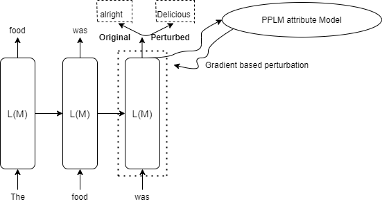

# How does PPLM works?

Plug and Play Language Models or PPLM controls the generation of sentences in Large Language Models like GPT2 using gradient based steering towards control attributes. The gradient is evaluated based on Attribute Model being used, which is then used to perturb hidden state or past key values of the model. The perturbation is applied such that it pushes the generation towards the desired attribute.

<p align="center">
    
    **Figure 1** Simplified version of how PPLM works
</p>

## Attribute Models

PPLM.jl provides with the following two Attribute models:

### Bag Of Words or BoW Model

Bag of Words model consist of a list of words that belong to a particular Topic. The loss for this model is evaluated so as to increase probability of words belonging to this list while decreasing the rest, hence, pushing the genration towards desired topic.

Bag of words available are: `legal`, `military`, `politics`, `monsters`, `science`, `space`, `technology`, `religion` and `positive_words`.
Source: [https://github.com/uber-research/PPLM](https://github.com/uber-research/PPLM)

### Discriminator Model

Discriminator Model consist of a trainable ClassifierHead which is basically a Linear layer. The layer is trained for classification of desired attribute. This trained model is then further used to calculate the gradients based on crossentropy loss of generation.

PPLM.jl currently supports `Detoxification` model for GPT2-small and `sentiment` and `clickbait` for GPT2-medium. (Note: GPT2-medium may give some errors while downloading the model files, because of some file mode issue in Transformers.jl. To rectify, please change the mode of Transformers.jl Huggingface Artifacts.toml file, to allow loading the GPT2 model).

PPLM.jl further supports training your own Discriminator model and then generate with that model, by providing path to the saved BSON file of model ClassifierHead, along with `config_metadata`. 

## Support

PPLM.jl provides support for attribute control based on:
<ol>
    <li> Hidden State Perturbation
    <li> Past Key Values Perturbation
</ol>

For more details, check out the implementation in the repo.

## PPLM

PPLM struct for hyperparameters for generation looks like this:

```julia
@with_kw struct pplm
    method::String="BoW"
    perturb::String="hidden"     # hidden or past -> hidden support BoW only without gradient based change
    bow_list::Vector{String}=["military"]
    discrim::String="toxicity"
    embed_size::Int=768
    target_class_id=-1
    file_name::String=""
    path::String=""
    stepsize::Float32=0.01      
    max_length::Int=100
    num_iterations::Int=2        # more the number of iterations, more updates, more time to update
    top_k::Int=50
    top_p::Float32=0.8
    temperature::Float32=1.1
    fusion_gm_scale::Float32=0.9
    fusion_kl_scale::Float32=0.01
    cuda::Tuple{Bool, Int64}=(CUDA.has_cuda(), device_id)
    window_length::Int=0          # window length 0 corresponds to infinite length
    gamma::Float32=1.5
end
```

These hyperparameters can be tuned as per the desired attribute. Some of the examples of pplm arguments looks like this:

```julia
# bow model
args = pplm(method="BoW", bow_list=["legal"], num_iterations=3)

# discriminator model
args = pplm(method="Discrim", perturb="past", stepsize=0.02)
```
